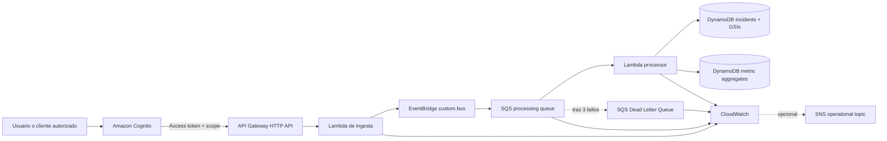
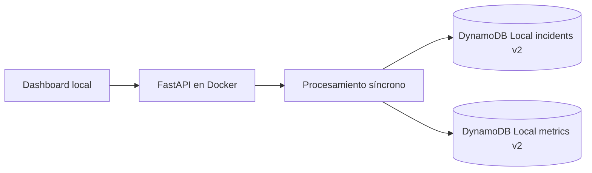

# AWS CloudOps Incident Hub

[](https://github.com/fermarfer1982/aws-cloudops-incident-hub/actions/workflows/validate.yml)
[](https://github.com/fermarfer1982/aws-cloudops-incident-hub/actions/workflows/pages.yml)

Plataforma serverless para recibir, clasificar y gestionar incidencias de infraestructura. El proyecto demuestra arquitectura AWS, Infrastructure as Code, seguridad, resiliencia, observabilidad, CI/CD y gobierno de costes.

> El laboratorio funciona en Docker y la demo pública usa datos simulados en GitHub Pages. La arquitectura AWS puede desplegarse de forma efímera y dispone de un perfil persistente opcional, pero no mantiene ningún stack activo por defecto.

## Demo pública

```text
https://fermarfer1982.github.io/aws-cloudops-incident-hub/
```

La demo es estática y no expone la red local ni una API AWS.

## Qué demuestra

- API FastAPI portable entre Docker y AWS Lambda.
- Amazon API Gateway HTTP API con Amazon Cognito y autorización mediante scopes JWT.
- CORS restringido mediante allowlist configurable.
- Procesamiento asíncrono con EventBridge, SQS, Lambda y Dead Letter Queue.
- Idempotencia y respuestas parciales de lotes SQS.
- DynamoDB Query mediante GSIs por fecha, sede, estado y severidad.
- Métricas incrementales actualizadas con transacciones DynamoDB.
- CloudWatch dashboard, alarmas y runbooks operativos.
- Perfil persistente opcional con DynamoDB PITR, recursos retenidos y logs de 30 días.
- Routing opcional de alarmas mediante SNS y email confirmado.
- Objetivos RTO/RPO y SLO versionados.
- AWS CDK, CloudFormation, tests y guardrails de coste y seguridad.
- GitHub Actions con OIDC y credenciales STS temporales.
- Despliegue efímero, pruebas de humo y destrucción automática.
- Revisión AWS Well-Architected y backlog de remediación.
- Blueprint multi-account con Organizations, IAM Identity Center y promoción Dev → Stage → Prod.

## Arquitectura AWS de referencia



El API cloud aplica estos scopes antes de invocar Lambda:

| Scope | Operaciones |
|---|---|
| `cloudops-incident-hub/incidents.read` | `GET /events`, `GET /metrics` |
| `cloudops-incident-hub/incidents.write` | `POST /events` |
| `cloudops-incident-hub/incidents.manage` | `PATCH /events/{incident_id}/status` |

`GET /health` permanece público para health checks. El resto de rutas del API Gateway requiere un access token válido y el scope correspondiente.

## Modo local



El modo local no usa Cognito ni API Gateway. Permanece sin autenticación cloud porque está destinado exclusivamente a desarrollo dentro de una red confiable. Sí utiliza una allowlist CORS explícita.

## Inicio rápido en Ubuntu Server

### Requisitos

- Docker Engine con Docker Compose.
- Git.
- Puertos TCP 8080 y 8081 accesibles desde la red local.

### Arrancar

```bash
cd /opt/aws-cloudops-incident-hub
cp .env.example .env
docker compose up -d --build
```

Comprobar el backend:

```bash
curl -s http://localhost:8080/health | python3 -m json.tool
```

Abrir el dashboard:

```text
http://IP_DEL_SERVIDOR:8081
```

En **Fuente de datos**, selecciona **API local**.

### Esquema local actual

```text
cloudops-incidents-v2
cloudops-incident-metrics-v2
```

Cargar incidencias de ejemplo:

```bash
bash scripts/seed_demo.sh
```

### Consultar la API local

```bash
curl -s http://localhost:8080/events | python3 -m json.tool
curl -s http://localhost:8080/metrics | python3 -m json.tool
```

Crear una incidencia:

```bash
curl -s -X POST http://localhost:8080/events \
  -H 'Content-Type: application/json' \
  -d '{
    "source": "pbs-01",
    "site": "Calahorra",
    "type": "BACKUP_FAILED",
    "message": "La copia de vm-105 ha fallado"
  }' | python3 -m json.tool
```

Simular EventBridge → SQS → Lambda en local:

```bash
make simulate-async
```

Documentación OpenAPI:

```text
http://IP_DEL_SERVIDOR:8080/docs
```

### Detener

Conservar datos:

```bash
docker compose down
```

Eliminar también el volumen local:

```bash
docker compose down -v
```

## Modelo DynamoDB

La tabla de incidencias mantiene `incident_id` como clave primaria y define cuatro GSIs:

| Índice | Partition key | Sort key | Uso |
|---|---|---|---|
| `incidents-by-time` | `entity_type` | `created_at` | Incidencias más recientes |
| `incidents-by-site` | `site` | `created_at` | Incidencias por sede |
| `incidents-by-status` | `status` | `created_at` | Incidencias por estado |
| `incidents-by-severity` | `severity` | `created_at` | Incidencias por severidad |

Los listados utilizan `Query`, no `Scan`. Una segunda tabla mantiene contadores globales y por sede. La creación de incidencias y los cambios de estado actualizan datos y contadores mediante transacciones.

## Perfiles CDK

### Efímero, por defecto

```bash
cd infrastructure
cdk synth
```

- Tablas y logs se eliminan con el stack.
- PITR desactivado.
- Logs de un día.
- Sin SNS ni acciones de notificación.

### Persistente, opcional

```bash
cd infrastructure
cdk synth \
  -c persistent_environment=true \
  -c alarm_notification_email=ops@example.com
```

- PITR habilitado para ambas tablas.
- Tablas y log groups con `Retain`.
- Logs de 30 días.
- Las cuatro alarmas publican estados ALARM y OK en SNS.
- El receptor debe confirmar la suscripción por email.

El perfil persistente puede generar costes y no se activa en CI ni en el workflow efímero.

## Desarrollo y validación

```bash
python3 -m venv .venv
source .venv/bin/activate
pip install -r backend/requirements-dev.txt
pip install -r infrastructure/requirements.txt

export PYTHONPATH="$PWD/backend"
pytest -q tests

cd infrastructure
PYTHONPATH=. python -m pytest -q tests
cd ..
```

Guardrails ejecutables:

```bash
python3 scripts/check_zero_cost.py infrastructure/cdk.out/CloudOpsIncidentHubStack.template.json
python3 scripts/check_oidc_workflows.py
python3 scripts/check_well_architected_review.py
python3 scripts/check_multi_account_blueprint.py
python3 scripts/check_p0_controls.py
python3 scripts/check_p1_controls.py
```

La CI falla si detecta, entre otros problemas:

- Recursos de alto riesgo de coste.
- Access keys AWS permanentes en workflows.
- Disparadores OIDC inseguros.
- Pérdida de artefactos Well-Architected o multi-account.
- CORS comodín.
- Rutas cloud sin scopes JWT.
- Uso de DynamoDB Scan en rutas operativas.
- Pérdida de PITR, retención, alarm routing, RTO/RPO, SLO o runbooks P1.

## Despliegue efímero con GitHub OIDC

El workflow **Deploy ephemeral AWS lab**:

1. Exige confirmación manual.
2. Obtiene credenciales temporales mediante OIDC.
3. Ejecuta tests, CDK synth y guardrails.
4. Despliega el stack efímero.
5. Comprueba `/health` y la frontera JWT.
6. Inyecta un evento sintético en EventBridge.
7. Verifica su persistencia en DynamoDB.
8. Conserva evidencias durante siete días.
9. Ejecuta `cdk destroy` y comprueba la eliminación.

Existe además **Destroy ephemeral AWS lab** como mecanismo de limpieza de emergencia. No se almacenan access keys AWS en GitHub.

## Observabilidad y recuperación

La plantilla crea el dashboard `cloudops-incident-hub-operations` y alarmas para:

- Errores de la Lambda de ingesta.
- Errores de la Lambda procesadora.
- Antigüedad del mensaje más antiguo.
- Mensajes presentes en la DLQ.

Documentación:

- [Diseño de observabilidad](docs/observability.md).
- [Runbook de la DLQ](docs/runbook-dlq.md).
- [Procesamiento event-driven](docs/event-driven-processing.md).
- [Controles P1](docs/p1-reliability-operations.md).
- [Objetivos RTO/RPO](docs/recovery-objectives.md).
- [Runbook de restauración DynamoDB](docs/runbook-dynamodb-restore.md).
- [SLO provisionales](docs/service-level-objectives.md).
- [Controles de coste](docs/cost-controls.md).

Los targets iniciales son RPO de 15 minutos y RTO single-region de 60 minutos. Son objetivos de ingeniería pendientes de validación mediante un restore real; no son un SLA.

## AWS Well-Architected

WA-001 a WA-005 están completados en la implementación de referencia. WA-006, WA-007, WA-008, WA-009, WA-011, WA-014 y WA-015 tienen ahora documentación o IaC parcial, pero siguen pendientes aprobaciones, configuración de cuenta y evidencia operativa real.

El workload continúa **sin estar preparado para producción**. Permanecen abiertos ownership, restore probado, budget activo, protección frente a abuso, supply-chain security, paginación, carga y tuning empírico.

- [Revisión completa](docs/well-architected-review.md).
- [Backlog de remediación](docs/well-architected-backlog.md).
- [Controles P0](docs/p0-production-controls.md).

## Arquitectura multi-account

El target state separa Management, Log Archive, Security Tooling, Shared Services, Network, CloudOps Dev, Stage, Prod y Sandbox. Los usuarios accederían mediante IAM Identity Center y los pipelines utilizarían roles OIDC separados por cuenta.

- [Arquitectura multi-account](docs/multi-account-production-architecture.md).
- [Matriz de controles](docs/multi-account-control-matrix.md).
- [Plan de migración](docs/multi-account-migration-plan.md).
- [Blueprint JSON](governance/organization-blueprint.json).

## Coste

El modo local y GitHub Pages no consumen servicios AWS. El despliegue AWS es opcional. Un despliegue persistente puede generar cargos por PITR, logs retenidos, CloudWatch, SNS y otros servicios. AWS Budgets y Cost Anomaly Detection deben configurarse a nivel de cuenta antes de activarlo.

## Roadmap

- [x] API local compatible con Lambda.
- [x] DynamoDB Local y dashboard público.
- [x] AWS CDK, tests y guardrails de coste.
- [x] EventBridge, SQS, DLQ, idempotencia y reintentos.
- [x] CloudWatch dashboard, alarmas y runbook.
- [x] GitHub OIDC, despliegue efímero y limpieza de emergencia.
- [x] Revisión Well-Architected y backlog.
- [x] Arquitectura multi-account y plan de migración.
- [x] Cognito, scopes JWT y CORS restringido.
- [x] DynamoDB Query y métricas incrementales sin Scan.
- [x] Referencia P1: PITR, retención, RTO/RPO, SLO y alarm routing opcional.
- [ ] Evidencia P1: restore real, ownership, budgets activos y estrategia regional aprobada.
- [ ] Seguridad P1: throttling, protección frente a abuso y supply-chain security.
- [ ] Paginación, carga y tuning empírico.

## Licencia

MIT.
