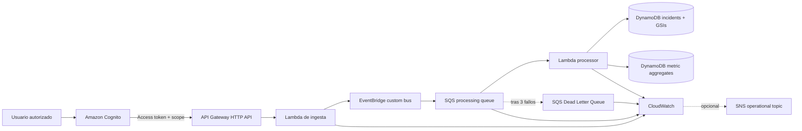

# AWS CloudOps Incident Hub

[](https://github.com/fermarfer1982/aws-cloudops-incident-hub/actions/workflows/validate.yml)
[](https://github.com/fermarfer1982/aws-cloudops-incident-hub/actions/workflows/codeql.yml)
[](https://github.com/fermarfer1982/aws-cloudops-incident-hub/actions/workflows/pages.yml)

Plataforma serverless para recibir, clasificar y gestionar incidencias de infraestructura. El proyecto demuestra arquitectura AWS, Infrastructure as Code, seguridad, resiliencia, observabilidad, CI/CD, rendimiento y gobierno de costes.

> El laboratorio funciona en Docker y la demo pública usa datos simulados en GitHub Pages. La arquitectura AWS puede desplegarse de forma efímera y dispone de un perfil persistente opcional, pero no mantiene ningún stack activo por defecto.

## Demo pública

```text
https://fermarfer1982.github.io/aws-cloudops-incident-hub/
```

La demo es estática y no expone la red local ni una API AWS.

## Qué demuestra

- FastAPI portable entre Docker y AWS Lambda.
- API Gateway HTTP API con Amazon Cognito y scopes JWT.
- CORS restringido y throttling explícito.
- EventBridge, SQS, Lambda y Dead Letter Queue.
- Idempotencia y respuestas parciales de lotes SQS.
- DynamoDB Query mediante cuatro GSIs, sin Scan operativo.
- Paginación por cursor basada en `LastEvaluatedKey`.
- Métricas incrementales mediante transacciones DynamoDB.
- CloudWatch dashboard, alarmas y runbooks.
- Perfil persistente opcional con PITR, Retain y logs de 30 días.
- Routing opcional de alarmas mediante SNS.
- GitHub Actions, OIDC, CodeQL, Dependabot, control de secretos y SBOM.
- Baseline local validado con p50, p95, p99, throughput e integridad de paginación.
- Baseline AWS efímero validado con Cognito M2M, métricas nativas y limpieza automática.
- Revisión AWS Well-Architected y blueprint multi-account.

## Arquitectura AWS de referencia



Scopes cloud:

| Scope | Operaciones |
|---|---|
| `cloudops-incident-hub/incidents.read` | `GET /events`, `GET /metrics` |
| `cloudops-incident-hub/incidents.write` | `POST /events` |
| `cloudops-incident-hub/incidents.manage` | `PATCH /events/{incident_id}/status` |

`GET /health` permanece público. El resto de rutas cloud requiere token y scope.

## Inicio rápido en Ubuntu Server

### Arrancar

```bash
cd /opt/aws-cloudops-incident-hub
cp .env.example .env
docker compose up -d --build
```

Comprobar:

```bash
curl -s http://localhost:8080/health | python3 -m json.tool
bash scripts/seed_demo.sh
curl -s http://localhost:8080/metrics | python3 -m json.tool
```

Dashboard local:

```text
http://IP_DEL_SERVIDOR:8081
```

El modo local usa:

```text
cloudops-incidents-v2
cloudops-incident-metrics-v2
```

No utiliza Cognito ni API Gateway y debe mantenerse dentro de una red de laboratorio confiable.

## API y paginación

Primera página:

```bash
curl -i "http://localhost:8080/events?limit=25"
```

Cuando existen más resultados, la API devuelve:

```text
X-Next-Token: <opaque-token>
```

Página siguiente:

```bash
curl -i --get "http://localhost:8080/events" \
  --data-urlencode "limit=25" \
  --data-urlencode "next_token=<opaque-token>"
```

El cuerpo continúa siendo un array JSON. El token es versionado, opaco y está vinculado a los filtros `site`, `status` y `severity`. Un token inválido o reutilizado con otros filtros devuelve HTTP 400.

La tabla de incidencias define:

| Índice | Partition key | Sort key |
|---|---|---|
| `incidents-by-time` | `entity_type` | `created_at` |
| `incidents-by-site` | `site` | `created_at` |
| `incidents-by-status` | `status` | `created_at` |
| `incidents-by-severity` | `severity` | `created_at` |

Más información: [paginación y pruebas de carga](docs/pagination-load-testing.md).

## Prueba de carga local

Instalar dependencias de desarrollo:

```bash
python3 -m venv .venv
source .venv/bin/activate
pip install -r backend/requirements-dev.txt
```

Baseline de lectura:

```bash
python3 scripts/run_load_test.py \
  --base-url http://localhost:8080 \
  --duration 60 \
  --concurrency 20 \
  --output artifacts/local-load-test.json
```

O mediante Make:

```bash
make load-test
```

Las escrituras sintéticas están desactivadas por defecto. Para incluir un 5%:

```bash
python3 scripts/run_load_test.py \
  --duration 60 \
  --concurrency 20 \
  --write-percent 5 \
  --output artifacts/local-mixed-load-test.json
```

El baseline local del 10 de julio de 2026 registró aproximadamente 158–159 lecturas por segundo y 150 peticiones por segundo con un 5% de escrituras, sin errores. El p95 máximo fue 141,59 ms. La validación recorrió 365 incidencias en cuatro páginas, con 365 IDs únicos y cero duplicados.

Evidencia: [baseline local validado](docs/performance-baseline-local-2026-07-10.md).

El baseline AWS controlado del 12 de julio de 2026 sostuvo 5,01 peticiones por
segundo durante 30 segundos, con 152 solicitudes, 0% de errores, p95 de
163,59 ms, cero throttles Lambda y procesamiento completo de los dos eventos
asíncronos.

Evidencia: [baseline AWS validado](docs/performance-baseline-aws-2026-07-12.md).

## Perfiles CDK

### Efímero, por defecto

```bash
cd infrastructure
cdk synth
```

- DynamoDB y logs se eliminan con el stack.
- PITR desactivado.
- Logs de un día.
- Sin SNS ni acciones de notificación.
- Sin cliente OAuth de máquina para pruebas de carga.

### Persistente, opcional

```bash
cd infrastructure
cdk synth \
  -c persistent_environment=true \
  -c alarm_notification_email=ops@example.com
```

- PITR en las dos tablas.
- Tablas y log groups con `Retain`.
- Logs de 30 días.
- Alarmas ALARM y OK hacia SNS.

El perfil persistente puede generar costes y no se activa en CI ni en el workflow efímero.

### Rendimiento AWS efímero, solo bajo aprobación

```bash
cd infrastructure
cdk synth \
  -c enable_load_test_client=true
```

Este contexto añade un cliente Cognito temporal de `client_credentials`, con scopes de lectura y escritura y token de 15 minutos. Solo está previsto para el workflow manual de rendimiento; no se activa en la referencia normal.

## Seguridad y supply chain

- Cognito y scopes JWT.
- CORS allowlist.
- Throttling por defecto: 10 requests/s y burst 20.
- CodeQL para Python.
- Dependabot para Python, Docker y GitHub Actions.
- Guardrail de patrones comunes de secretos.
- `SECURITY.md` y private vulnerability reporting recomendado.
- SBOM SPDX JSON mediante workflow manual o sobre `main`.

Guía: [seguridad operacional y supply chain](docs/operational-security-supply-chain.md).

## Desarrollo y validación

```bash
python3 -m venv .venv
source .venv/bin/activate
pip install -r backend/requirements-dev.txt
pip install -r infrastructure/requirements.txt

export PYTHONPATH="$PWD/backend"
pytest -q tests

cd infrastructure
PYTHONPATH=. python -m pytest -q tests
cdk synth --quiet
cd ..
```

Guardrails:

```bash
python3 scripts/check_repository_secrets.py
python3 scripts/check_zero_cost.py infrastructure/cdk.out/CloudOpsIncidentHubStack.template.json
python3 scripts/check_oidc_workflows.py
python3 scripts/check_well_architected_review.py
python3 scripts/check_multi_account_blueprint.py
python3 scripts/check_p0_controls.py
python3 scripts/check_p1_controls.py
python3 scripts/check_security_supply_chain.py
python3 scripts/check_pagination_load_testing.py
python3 scripts/check_aws_performance_workflow.py
```

## Despliegues efímeros con GitHub OIDC

El workflow de smoke test manual:

1. Exige confirmación textual.
2. Obtiene credenciales STS mediante OIDC.
3. Ejecuta tests, synth y guardrails.
4. Despliega el stack efímero.
5. Verifica `/health`, la frontera JWT y el flujo EventBridge → SQS → Lambda → DynamoDB.
6. Conserva evidencias durante siete días.
7. Ejecuta `cdk destroy` y comprueba la eliminación.

El workflow de rendimiento AWS fue **ejecutado y validado el 12 de julio de 2026**. Incluye:

- Aprobación explícita y confirmación de controles de coste.
- Duración máxima de 60 segundos.
- Concurrencia máxima de 5.
- Techo global máximo de 8 requests/s.
- Escrituras sintéticas limitadas al 5%.
- Token Cognito de máquina temporal y enmascarado.
- Métricas nativas de API Gateway, Lambda, SQS y DynamoDB.
- Evidencia saneada durante 14 días.
- Destrucción obligatoria y verificación del borrado del stack.

La ejecución validada registró 152 solicitudes correctas, 0% de errores,
p95 de 163,59 ms y ausencia de throttling. El stack fue destruido y
`AWS_LOAD_TEST_APPROVED` volvió a `false`.

No se almacenan access keys AWS en GitHub. No se debe ejecutar una prueba de carga en AWS sin aprobación, presupuesto, límites de tráfico y limpieza.

Guía: [prueba AWS efímera y controlada](docs/aws-performance-test.md).

## Documentación principal

- [Observabilidad](docs/observability.md)
- [Runbook de DLQ](docs/runbook-dlq.md)
- [Objetivos RTO/RPO](docs/recovery-objectives.md)
- [Restauración DynamoDB](docs/runbook-dynamodb-restore.md)
- [SLO provisionales](docs/service-level-objectives.md)
- [Ownership y matriz RACI](docs/workload-ownership.md)
- [Controles de coste](docs/cost-controls.md)
- [Evidencia AWS de gobierno de costes](docs/aws-cost-governance-evidence-2026-07-12.md)
- [Paginación y carga](docs/pagination-load-testing.md)
- [Baseline local](docs/performance-baseline-local-2026-07-10.md)
- [Baseline AWS](docs/performance-baseline-aws-2026-07-12.md)
- [Prueba AWS controlada](docs/aws-performance-test.md)
- [Well-Architected Review](docs/well-architected-review.md)
- [Backlog Well-Architected](docs/well-architected-backlog.md)
- [Arquitectura multi-account](docs/multi-account-production-architecture.md)
- [ADR](docs/adr/README.md)

## Estado Well-Architected

La referencia ya implementa autenticación, autorización, CORS, consultas sin Scan, métricas incrementales, PITR opcional, alarm routing opcional, throttling, supply-chain security, paginación, ownership y baselines local y AWS validados.

El workload continúa **sin declararse production-ready** hasta obtener evidencia real de:

- Restore PITR y rollback.
- Ownership organizativo de producción y cobertura on-call.
- Cost allocation tags, unit economics y revisión financiera de producción.
- Receptor real de alarmas.
- Tuning comparativo de Lambda, SQS y throttling cuando exista un objetivo
  de escala superior al baseline actual.
- Game day y revisión Well-Architected posterior.

## Roadmap

- [x] API local, DynamoDB Local y dashboard.
- [x] EventBridge, SQS, DLQ, idempotencia y reintentos.
- [x] CloudWatch, alarmas y runbooks.
- [x] GitHub OIDC y despliegue efímero.
- [x] Well-Architected y arquitectura multi-account.
- [x] Cognito, scopes JWT y CORS restringido.
- [x] DynamoDB Query y métricas incrementales sin Scan.
- [x] PITR, RTO/RPO, SLO y alarm routing opcional.
- [x] Ownership técnico y matriz RACI del laboratorio.
- [x] AWS Budgets y Cost Anomaly Detection evidenciados en el laboratorio.
- [x] Throttling, CodeQL, Dependabot, secretos y SBOM.
- [x] Paginación por cursor y framework de pruebas de carga.
- [x] Baseline local validado y versionado.
- [x] Workflow AWS de rendimiento efímero y controlado preparado.
- [x] Ejecutar el baseline AWS con aprobación, presupuesto y limpieza verificada.
- [ ] Ajustar recursos únicamente a partir de evidencia AWS comparativa.
- [ ] Obtener evidencias P1 reales de restore y alarmas.

## Licencia

MIT.
