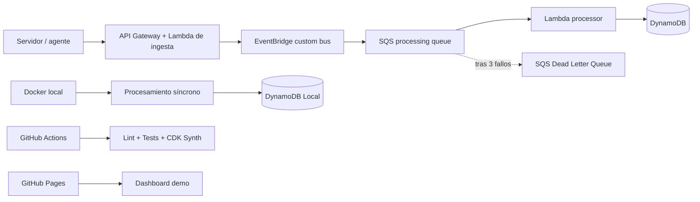

# AWS CloudOps Incident Hub

[](https://github.com/fermarfer1982/aws-cloudops-incident-hub/actions/workflows/validate.yml)
[](https://github.com/fermarfer1982/aws-cloudops-incident-hub/actions/workflows/pages.yml)

Plataforma serverless para recibir, clasificar y gestionar incidencias de infraestructura. El proyecto está orientado a demostrar competencias de **AWS Solutions Architecture**, Infrastructure as Code, seguridad, observabilidad y optimización de costes.

> El laboratorio funciona íntegramente en local. La demo pública se publica en GitHub Pages. No es necesario mantener recursos activos en AWS.

## Qué demuestra

- Diseño para Amazon API Gateway, AWS Lambda y Amazon DynamoDB.
- Backend Python portable entre Docker local y Lambda.
- Infraestructura declarada con AWS CDK y sintetizada a CloudFormation.
- Tests de aplicación y de infraestructura.
- Políticas IAM limitadas al recurso requerido.
- Guardrails automáticos contra recursos de alto riesgo de coste.
- Dashboard público con datos de demostración.
- Procesamiento asíncrono con EventBridge, SQS, Lambda y Dead Letter Queue.
- Idempotencia mediante identificadores deterministas y escrituras condicionales.
- Respuestas parciales de lotes SQS para reintentar solo los mensajes fallidos.

## Arquitectura MVP



En local, la API utiliza un adaptador síncrono para no depender de servicios cloud. En AWS, `POST /events` publica el evento en EventBridge y devuelve `202 Accepted`; SQS desacopla la ingesta del procesamiento y la DLQ conserva los mensajes que superan el límite de reintentos.

## Inicio rápido en Ubuntu Server

### Requisitos

- Docker Engine con el plugin Docker Compose.
- Git.
- Puertos TCP 8080 y 8081 accesibles desde tu red local.

### Arrancar

```bash
cp .env.example .env
docker compose up -d --build
```

Comprobar:

```bash
curl http://localhost:8080/health
```

Abrir el dashboard:

```text
http://IP_DEL_SERVIDOR:8081
```

En el selector **Fuente de datos**, elige **API local** para trabajar contra el backend real.

### Cargar incidencias de ejemplo

```bash
bash scripts/seed_demo.sh
```

### Consultar la API

```bash
curl http://localhost:8080/events | python -m json.tool
curl http://localhost:8080/metrics | python -m json.tool
```

### Simular el contrato EventBridge → SQS en local

```bash
make simulate-async
```

Este comando ejecuta el handler de la Lambda procesadora dentro del contenedor, usando un sobre con el mismo formato que recibiría desde SQS, y persiste la incidencia en DynamoDB Local.

Documentación OpenAPI:

```text
http://IP_DEL_SERVIDOR:8080/docs
```

### Detener y conservar datos

```bash
docker compose down
```

### Eliminar también la base de datos local

```bash
docker compose down -v
```

## Desarrollo y validación

```bash
python3 -m venv .venv
source .venv/bin/activate
pip install -r backend/requirements-dev.txt
pip install -r infrastructure/requirements.txt
export PYTHONPATH="$PWD/backend"
pytest -q tests
cd infrastructure && pytest -q tests && cdk synth
```

El comando siguiente inspecciona la plantilla sintetizada y falla si encuentra NAT Gateway, EC2, RDS, ALB, EKS, OpenSearch o ElastiCache:

```bash
python scripts/check_zero_cost.py infrastructure/cdk.out/CloudOpsIncidentHubStack.template.json
```

## Endpoints

| Método | Ruta | Función |
|---|---|---|
| GET | `/health` | Estado de la API |
| POST | `/events` | Registrar localmente o aceptar un evento para procesamiento asíncrono |
| GET | `/events` | Listar y filtrar incidencias |
| PATCH | `/events/{id}/status` | Cambiar el estado |
| GET | `/metrics` | Resumen operacional |

Ejemplo:

```bash
curl -X POST http://localhost:8080/events \
  -H 'Content-Type: application/json' \
  -d '{
    "source": "pbs-01",
    "site": "Calahorra",
    "type": "BACKUP_FAILED",
    "message": "La copia de vm-105 ha fallado"
  }'
```

## GitHub Pages

El workflow `.github/workflows/pages.yml` publica automáticamente el directorio `frontend`.

Después de subir el repositorio:

1. Abre **Settings → Pages**.
2. Selecciona **GitHub Actions** como fuente.
3. Ejecuta el workflow **Publish demo** o sube un cambio a `frontend/`.

## Coste

La ejecución local y GitHub Pages no consumen servicios de AWS. La plantilla cloud está diseñada para despliegues efímeros y evita servicios con coste fijo o fácil de olvidar.

Consulta [docs/cost-control.md](docs/cost-control.md) y [docs/event-driven-processing.md](docs/event-driven-processing.md).

## Roadmap

- [x] API local compatible con Lambda.
- [x] DynamoDB Local.
- [x] Dashboard público.
- [x] AWS CDK y tests de infraestructura.
- [x] CI y guardrails de coste.
- [x] EventBridge, SQS y Dead Letter Queue.
- [x] Idempotencia, reintentos y respuestas parciales de lote.
- [ ] CloudWatch dashboard y alarmas.
- [ ] GitHub OIDC para despliegue temporal.
- [ ] Well-Architected review.
- [ ] Arquitectura multi-account de producción.

## Licencia

MIT.
