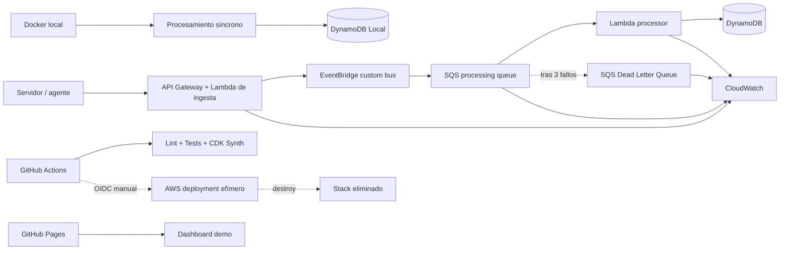
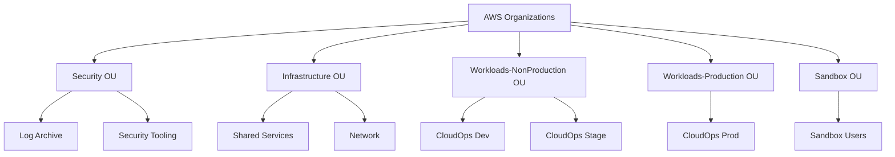

# AWS CloudOps Incident Hub

[](https://github.com/fermarfer1982/aws-cloudops-incident-hub/actions/workflows/validate.yml)
[](https://github.com/fermarfer1982/aws-cloudops-incident-hub/actions/workflows/pages.yml)

Plataforma serverless para recibir, clasificar y gestionar incidencias de infraestructura. El proyecto está orientado a demostrar competencias de **AWS Solutions Architecture**, Infrastructure as Code, seguridad, resiliencia, observabilidad y optimización de costes.

> El laboratorio funciona íntegramente en local. La demo pública se publica en GitHub Pages. No es necesario mantener recursos activos en AWS.

## Qué demuestra

- Diseño para Amazon API Gateway, AWS Lambda y Amazon DynamoDB.
- Backend Python portable entre Docker local y Lambda.
- Infraestructura declarada con AWS CDK y sintetizada a CloudFormation.
- Tests de aplicación y de infraestructura.
- Políticas IAM limitadas al recurso requerido.
- Guardrails automáticos contra recursos de alto riesgo de coste.
- Dashboard público con datos de demostración.
- Procesamiento asíncrono con EventBridge, SQS, Lambda y Dead Letter Queue.
- Idempotencia mediante identificadores deterministas y escrituras condicionales.
- Respuestas parciales de lotes SQS para reintentar solo los mensajes fallidos.
- Dashboard de CloudWatch y alarmas operativas basadas en métricas nativas.
- Runbook para investigación y redrive controlado de mensajes en la DLQ.
- Despliegue efímero manual con GitHub OIDC y credenciales STS temporales.
- Destrucción automática y workflow independiente de limpieza de emergencia.
- Autoevaluación AWS Well-Architected con riesgos, evidencias y backlog de remediación.
- Blueprint multi-account con Organizations, Identity Center, cuentas fundacionales, SCP y promoción Dev → Stage → Prod.

## Arquitectura MVP



En local, la API utiliza un adaptador síncrono para no depender de servicios cloud. En AWS, `POST /events` publica el evento en EventBridge y devuelve `202 Accepted`; SQS desacopla la ingesta del procesamiento y la DLQ conserva los mensajes que superan el límite de reintentos.

## Inicio rápido en Ubuntu Server

### Requisitos

- Docker Engine con el plugin Docker Compose.
- Git.
- Puertos TCP 8080 y 8081 accesibles desde tu red local.

### Arrancar

```bash
cp .env.example .env
docker compose up -d --build
```

Comprobar:

```bash
curl http://localhost:8080/health
```

Abrir el dashboard:

```text
http://IP_DEL_SERVIDOR:8081
```

En el selector **Fuente de datos**, elige **API local** para trabajar contra el backend real.

### Cargar incidencias de ejemplo

```bash
bash scripts/seed_demo.sh
```

### Consultar la API

```bash
curl http://localhost:8080/events | python3 -m json.tool
curl http://localhost:8080/metrics | python3 -m json.tool
```

### Simular el contrato EventBridge → SQS en local

```bash
make simulate-async
```

Este comando ejecuta el handler de la Lambda procesadora dentro del contenedor, usando un sobre con el mismo formato que recibiría desde SQS, y persiste la incidencia en DynamoDB Local.

Documentación OpenAPI:

```text
http://IP_DEL_SERVIDOR:8080/docs
```

### Detener y conservar datos

```bash
docker compose down
```

### Eliminar también la base de datos local

```bash
docker compose down -v
```

## Desarrollo y validación

```bash
python3 -m venv .venv
source .venv/bin/activate
pip install -r backend/requirements-dev.txt
pip install -r infrastructure/requirements.txt
export PYTHONPATH="$PWD/backend"
pytest -q tests
cd infrastructure && PYTHONPATH=. python -m pytest -q tests && cdk synth
```

El comando siguiente inspecciona la plantilla sintetizada y falla si encuentra NAT Gateway, EC2, RDS, ALB, EKS, OpenSearch o ElastiCache:

```bash
python3 scripts/check_zero_cost.py infrastructure/cdk.out/CloudOpsIncidentHubStack.template.json
```

Los workflows OIDC también tienen guardrails estáticos:

```bash
python3 scripts/check_oidc_workflows.py
```

La estructura y trazabilidad de la revisión Well-Architected se validan con:

```bash
python3 scripts/check_well_architected_review.py
```

El blueprint multi-account tiene una comprobación ejecutable independiente:

```bash
python3 scripts/check_multi_account_blueprint.py
```

## Endpoints

| Método | Ruta | Función |
|---|---|---|
| GET | `/health` | Estado de la API |
| POST | `/events` | Registrar localmente o aceptar un evento para procesamiento asíncrono |
| GET | `/events` | Listar y filtrar incidencias |
| PATCH | `/events/{id}/status` | Cambiar el estado |
| GET | `/metrics` | Resumen operacional |

Ejemplo:

```bash
curl -X POST http://localhost:8080/events \
  -H 'Content-Type: application/json' \
  -d '{
    "source": "pbs-01",
    "site": "Calahorra",
    "type": "BACKUP_FAILED",
    "message": "La copia de vm-105 ha fallado"
  }'
```

## Observabilidad

La plantilla CDK crea un dashboard denominado `cloudops-incident-hub-operations` con métricas nativas de Lambda y SQS. También define cuatro alarmas:

- Errores de la Lambda de ingesta.
- Errores de la Lambda procesadora.
- Antigüedad excesiva del mensaje más antiguo.
- Presencia de mensajes en la Dead Letter Queue.

No se configuran acciones SNS automáticas y no se emiten métricas personalizadas. Consulta:

- [Diseño de observabilidad](docs/observability.md).
- [Runbook de la Dead Letter Queue](docs/runbook-dlq.md).
- [ADR-003: métricas nativas de CloudWatch](docs/adr/003-native-cloudwatch-observability.md).

## Despliegue efímero con GitHub OIDC

El workflow `Deploy ephemeral AWS lab` se ejecuta solo de forma manual desde `main`. Utiliza un token OIDC de GitHub para obtener credenciales STS temporales, despliega el stack, ejecuta pruebas de humo, conserva evidencias durante siete días y llama a `cdk destroy` aunque falle una prueba anterior.

No se almacenan access keys de AWS en GitHub. La política de confianza está restringida al repositorio y al environment `aws-ephemeral`.

También existe `Destroy ephemeral AWS lab` para una limpieza manual de emergencia cuando una ejecución no alcanza su fase de destrucción.

La configuración completa está en:

- [Despliegue con GitHub OIDC](docs/github-oidc-deployment.md).
- [Plantilla del rol federado](bootstrap/github-oidc-role.yml).
- [ADR-004: despliegue efímero mediante OIDC](docs/adr/004-github-oidc-ephemeral-deployment.md).

Mantener estos workflows sin configurarlos ni ejecutarlos no crea recursos en AWS. Un despliegue real debe hacerse con créditos o Free Plan, alertas de gasto y revisión posterior; no se considera una garantía absoluta de 0,00 €.

## AWS Well-Architected Review

El repositorio contiene una autoevaluación versionada contra los seis pilares del AWS Well-Architected Framework:

- Excelencia operativa.
- Seguridad.
- Fiabilidad.
- Eficiencia del rendimiento.
- Optimización de costes.
- Sostenibilidad.

La revisión distingue entre controles existentes, riesgos aceptados exclusivamente para el laboratorio y bloqueadores de producción. No se presenta como una auditoría externa ni como una revisión realizada en AWS Well-Architected Tool.

Conclusiones principales:

- La arquitectura es sólida como laboratorio serverless y demostración de portfolio.
- El API anónimo y el CORS abierto son bloqueadores para producción.
- Los accesos basados en DynamoDB Scan deben sustituirse antes de escalar.
- RTO, RPO, SLO, ownership y restauración todavía no están definidos.
- El lifecycle efímero y los guardrails reducen el riesgo de coste, pero no sustituyen AWS Budgets y controles de cuenta.

Documentación:

- [Revisión completa](docs/well-architected-review.md).
- [Backlog de remediación](docs/well-architected-backlog.md).
- [ADR-005: enfoque de autoevaluación](docs/adr/005-well-architected-self-assessment.md).

## Arquitectura multi-account de producción

El target state de producción separa gobierno, seguridad, logging, plataforma y workloads mediante AWS Organizations:



El management account queda reservado para Organizations, billing, Identity Center e integraciones organizativas. Los usuarios acceden mediante IAM Identity Center; los pipelines usan roles OIDC separados por cuenta y promocionan artefactos inmutables de Dev a Stage y Prod.

Esta fase es exclusivamente documental: no crea cuentas, OUs, Control Tower, SCP, servicios de seguridad ni costes AWS.

Documentación:

- [Arquitectura multi-account completa](docs/multi-account-production-architecture.md).
- [Matriz de controles](docs/multi-account-control-matrix.md).
- [Plan de migración por fases](docs/multi-account-migration-plan.md).
- [Blueprint estructurado](governance/organization-blueprint.json).
- [ADR-006: landing zone multi-account](docs/adr/006-multi-account-production-landing-zone.md).

## GitHub Pages

El workflow `.github/workflows/pages.yml` publica automáticamente el directorio `frontend`.

Después de subir el repositorio:

1. Abre **Settings → Pages**.
2. Selecciona **GitHub Actions** como fuente.
3. Ejecuta el workflow **Publish demo** o sube un cambio a `frontend/`.

## Coste

La ejecución local y GitHub Pages no consumen servicios de AWS. La plantilla cloud está diseñada para despliegues efímeros y evita servicios con coste fijo o fácil de olvidar. No se mantiene un stack desplegado; cualquier despliegue real debe revisarse y destruirse al terminar la demostración.

La arquitectura multi-account representa un target state de producción. Implementarla sí crearía cuentas y servicios persistentes, por lo que requeriría una estimación separada, AWS Budgets, detección de anomalías y gobierno financiero.

Consulta [docs/cost-control.md](docs/cost-control.md), [docs/event-driven-processing.md](docs/event-driven-processing.md), [docs/observability.md](docs/observability.md), [docs/github-oidc-deployment.md](docs/github-oidc-deployment.md), [docs/well-architected-review.md](docs/well-architected-review.md) y [docs/multi-account-production-architecture.md](docs/multi-account-production-architecture.md).

## Roadmap

- [x] API local compatible con Lambda.
- [x] DynamoDB Local.
- [x] Dashboard público.
- [x] AWS CDK y tests de infraestructura.
- [x] CI y guardrails de coste.
- [x] EventBridge, SQS y Dead Letter Queue.
- [x] Idempotencia, reintentos y respuestas parciales de lote.
- [x] CloudWatch dashboard, alarmas y runbook operacional.
- [x] GitHub OIDC para despliegue temporal y limpieza de emergencia.
- [x] Well-Architected review y backlog de remediación.
- [x] Arquitectura multi-account de producción y plan de migración.

## Licencia

MIT.
