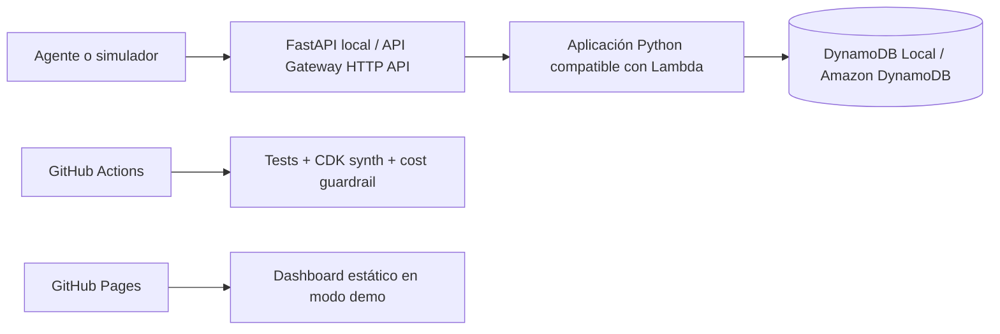
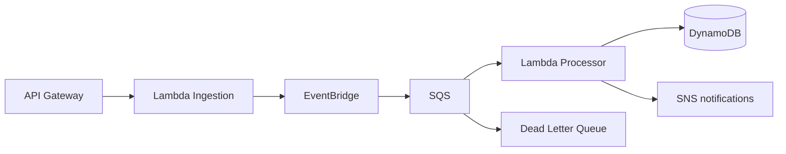

# Arquitectura

## MVP ejecutable

El código de negocio no depende del modo de ejecución. En local, Uvicorn sirve FastAPI dentro de Docker. En AWS, Mangum adapta el evento de API Gateway al mismo objeto ASGI.

## Fase 2

La fase 2 añadirá procesamiento asíncrono, reintentos, idempotencia y recuperación mediante DLQ.
