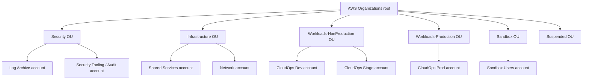
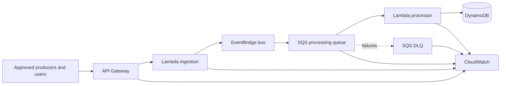

# Multi-account production architecture

## Document status

- **Workload:** AWS CloudOps Incident Hub
- **Status:** Target-state blueprint; not deployed
- **Decision owner:** Platform architecture
- **Primary Region:** `eu-west-1`
- **Secondary Region candidate:** `eu-central-1`
- **Review date:** 2026-07-10
- **Production readiness:** Blocked until the Well-Architected P0 and P1 findings are resolved

This document defines a production-oriented AWS multi-account target state. It does not create AWS Organizations, accounts, Control Tower resources, IAM Identity Center assignments, delegated administrators, budgets, trails, backup vaults, or networking resources.

The blueprint follows these design rules:

1. A single AWS Organization is the governance boundary.
2. AWS accounts are security, billing, quota, and failure-isolation boundaries.
3. Production and non-production workloads are separated into different accounts.
4. Security and audit evidence are owned outside workload accounts.
5. Human access is federated and group based.
6. Workload automation uses temporary credentials and dedicated cross-account roles.
7. The management account contains no application workloads.
8. Governance is introduced progressively and tested before broad OU attachment.

## Why multi-account

A single-account architecture can demonstrate application design, but it cannot provide strong separation between:

- Workload operators and security administrators.
- Production and development data.
- Application deployment and organization governance.
- Mutable workload resources and retained audit evidence.
- Cost ownership across environments.
- Account-level quotas and blast radius.

The multi-account design makes those boundaries explicit while keeping the application architecture serverless.

## Target organization

The organization is workload oriented rather than aligned to a company reporting chart. Controls are attached to OUs that share a common security and operational posture.

## Account responsibilities

| Account | OU | Responsibility | Workloads allowed | Primary human access |
|---|---|---|---:|---|
| Management | Root | Organizations, consolidated billing, organization integrations, root access management | No | Break-glass and tightly controlled platform administration |
| Log Archive | Security | Organization audit logs, Config history, access logs, long-term evidence | No | Security audit read-only and restricted log administrators |
| Security Tooling | Security | Delegated security administration, findings aggregation, incident investigation | No | Security engineering and incident response |
| Shared Services | Infrastructure | CI/CD artifacts, package mirrors, shared automation, optional integration services | No business workload | Platform engineering |
| Network | Infrastructure | Hybrid connectivity, shared DNS, inspection, private endpoint strategy when justified | No | Network and platform engineering |
| CloudOps Dev | Workloads-NonProduction | Developer integration using synthetic data | Yes | Developers within bounded permission sets |
| CloudOps Stage | Workloads-NonProduction | Production-like qualification, game days, performance and recovery testing | Yes | Release engineering; developers read-only by default |
| CloudOps Prod | Workloads-Production | Production API, event processing, DynamoDB data, telemetry | Yes | Operations read-only; pipeline write access; emergency elevation only |
| Sandbox Users | Sandbox | Time-bounded experiments without production connectivity or data | Yes | Named sandbox users |

## Management account restrictions

The management account is reserved for organization-level functions:

- AWS Organizations.
- Consolidated billing and account creation.
- IAM Identity Center organization instance.
- Organization integrations and delegated administrator registration.
- Root access management for member accounts.
- Control Tower landing zone administration if adopted.

It must not host the application stack, CI/CD artifacts, shared VPCs, security tools that support delegation, or operational dashboards for the workload. This limits exposure because service control policies do not restrict the management account.

## Control Tower decision

AWS Control Tower is the preferred accelerator for a new production landing zone when its managed governance model fits the organization. It can establish a landing zone with Security and Sandbox OUs, Log Archive and Audit accounts, IAM Identity Center integration, and mandatory preventive and detective controls.

The architecture remains logically valid without Control Tower, but manually reproducing account vending, guardrails, logging, drift management, and lifecycle governance increases operational burden.

### Recommendation

Use Control Tower for the first production landing zone unless an existing enterprise landing zone already provides equivalent capabilities. Do not modify Control Tower-managed resources outside supported mechanisms.

## Human identity and access

### Identity source

Use an **organization instance of AWS IAM Identity Center**. Connect an enterprise identity provider when available; otherwise, use the Identity Center directory temporarily.

### Assignment model

Assignments are group based. Direct user-to-account assignments are prohibited except for documented emergency access.

Recommended permission sets:

| Permission set | Scope | Intended use |
|---|---|---|
| `OrganizationReadOnly` | Organization-wide | Architecture and audit visibility |
| `SecurityAudit` | All member accounts | Read-only security review |
| `SecurityIncidentResponse` | Security and workload accounts | Time-bounded investigation and containment |
| `PlatformAdministrator` | Infrastructure and non-production | Landing-zone and platform operations |
| `WorkloadDeveloperNonProd` | Dev | Developer administration within workload boundaries |
| `WorkloadOperatorReadOnly` | Stage and Prod | Operational diagnosis without mutation |
| `ProductionDeployer` | Prod | Deployment pipeline role only; not normal human access |
| `BillingReadOnly` | Management | Cost and billing review |
| `BreakGlassAdministrator` | Selected accounts | Emergency-only, short session, monitored |

### Requirements

- MFA is enforced by the identity provider.
- Privileged sessions are short lived.
- Production write access requires elevation and approval.
- Access reviews occur at least quarterly.
- Shared users and long-lived workforce access keys are prohibited.
- Root credentials for member accounts are centrally managed or removed where supported.
- Emergency use generates an incident record and a post-use review.

## Workload deployment model

```mermaid
flowchart LR
    DEVBR[Feature branch] --> CI[Lint, tests, CDK synth, security and cost guardrails]
    CI --> ART[Immutable application and infrastructure artifacts]
    ART --> DROLE[OIDC deploy role: Dev]
    DROLE --> DEV[CloudOps Dev]
    DEV --> STAGEAPP[Protected Stage approval]
    STAGEAPP --> SROLE[OIDC deploy role: Stage]
    SROLE --> STAGE[CloudOps Stage]
    STAGE --> PRODAPP[Protected Production approval]
    PRODAPP --> PROLE[OIDC deploy role: Prod]
    PROLE --> PROD[CloudOps Prod]
```

### Pipeline principles

1. Build once and promote immutable artifacts.
2. Every target account has a dedicated deployment role and trust policy.
3. The GitHub OIDC `sub` condition is restricted to the repository and environment.
4. Production deploys run only from a protected branch and protected GitHub environment.
5. The production role cannot modify AWS Organizations, Identity Center, SCPs, organization trails, delegated administrators, or central log policies.
6. Workload roles cannot assume roles in Management, Log Archive, or Security Tooling.
7. Deployment evidence records commit, actor, target account, artifact digest, test results, and stack outputs.
8. Rollback criteria and post-deployment verification are mandatory.

### Separation of duties

- Developers author code and review pull requests.
- Release approvers authorize Stage and Production promotion.
- Platform engineering owns account baselines and deployment-role creation.
- Security owns security-service delegation and central findings.
- Cost owners approve budgets and investigate anomalies.

No individual should be able to modify application code, approve the same production deployment, and suppress the associated audit evidence without independent review.

## Security architecture

### Security Tooling account

Register supported services with this account as delegated administrator rather than operating them from the management account. Candidate services include:

- Amazon GuardDuty.
- AWS Security Hub.
- Amazon Inspector.
- IAM Access Analyzer.
- Amazon Macie when data classification and storage patterns justify it.

Central findings are visible to the security team while workload teams retain account-local remediation responsibilities.

### Log Archive account

The Log Archive account owns audit evidence that workload administrators cannot delete or rewrite. Candidate sources include:

- Organization CloudTrail.
- AWS Config delivery and snapshots.
- S3 access logs for central buckets.
- VPC Flow Logs when VPCs are introduced.
- Load balancer, API, WAF, and DNS logs when required.
- Selected security-service exports.

Production retention must be derived from legal, incident-response, and business requirements. The one-day laboratory log retention is not a production policy.

### Application security gates

Before production exposure:

- API authentication and operation-level authorization are mandatory.
- CORS uses an explicit allowlist.
- API throttling and abuse controls are defined.
- Public-versus-private API exposure is an explicit architectural decision.
- Secret scanning, dependency analysis, code scanning, and SBOM generation are enabled.
- Data classification and retention are approved.
- Encryption key ownership and rotation are documented.

## Service control policy strategy

SCPs define the maximum permissions available in accounts; they do not grant permissions. They are deployed in stages because an incorrect deny can interrupt account administration.

### Deployment sequence

1. Validate policy syntax and expected effects in CI.
2. Attach to a dedicated policy-staging OU.
3. Test with representative administrator, automation, service-linked, and break-glass paths.
4. Attach to Sandbox.
5. Attach to Workloads-NonProduction.
6. Attach to Workloads-Production after a successful observation period.
7. Apply specialized policies to Security and Suspended OUs.

### Planned controls

- Prevent member accounts from leaving the organization.
- Restrict unapproved Regions with explicit global-service exceptions.
- Prevent unauthorized changes to organization trails and Config.
- Prevent disabling delegated security services.
- Restrict high-risk services in Sandbox.
- Prevent creation of long-lived workforce access keys where feasible.
- Quarantine suspended accounts.
- Require approved resource tags through a combination of tag policies, IaC checks, and service-specific controls.

The repository includes only a low-risk illustrative SCP that denies `organizations:LeaveOrganization`. All other SCPs require account-specific validation and are intentionally not presented as deployable defaults.

## Application account architecture

Each workload account contains an independent instance of the serverless stack:

There is no cross-account runtime dependency between Dev, Stage, and Prod. Shared Services supports delivery and artifacts, but the production runtime continues operating if Shared Services is temporarily unavailable.

## Data protection and recovery

### Development

- Synthetic data only.
- Short retention.
- Deletion on teardown is acceptable.
- No recovery commitment.

### Stage

- Production-like schema and controls.
- Synthetic or irreversibly anonymized data.
- Recovery procedures and game days are exercised here.
- Retention is sufficient for qualification evidence.

### Production

- DynamoDB point-in-time recovery enabled.
- RTO and RPO approved before launch.
- Backup ownership is independent from the workload account where required.
- Restore procedures are tested and evidence retained.
- Data deletion, retention, and legal hold behavior are documented.
- Cross-account data access is denied by default.
- Regional recovery is selected from business requirements rather than assumed.

A second Region is not automatically active. `eu-central-1` is a candidate recovery Region pending data residency, latency, service availability, cost, and RTO/RPO decisions.

## Networking

The current core workload uses API Gateway, Lambda, EventBridge, SQS, DynamoDB, and CloudWatch and does not require a VPC solely to communicate between those managed services.

Do not add VPCs, NAT Gateways, Transit Gateway, centralized inspection, or interface endpoints merely to make the architecture look more enterprise. Introduce them only when a justified requirement exists, such as:

- Hybrid connectivity to corporate systems.
- Private API access.
- Private DNS integration.
- Egress inspection.
- Network-based data exfiltration controls.
- Connectivity to VPC-only services.

The Network account is reserved so those capabilities can be introduced without moving ownership into workload accounts.

## Observability and incident response

### Central view

- Workload metrics and alarms remain close to each workload account.
- Security findings aggregate in Security Tooling.
- Audit logs are delivered to Log Archive.
- Organization-level operational inventory can use Config aggregators or equivalent mechanisms.
- Alarm destinations are owned by an operations process, not by individual developers.

### Required production signals

- API availability, latency, throttling, and authorization failures.
- Lambda errors, throttles, concurrency, and duration.
- EventBridge failed invocations where applicable.
- SQS queue depth and age.
- DLQ message count.
- DynamoDB throttling and error metrics.
- Authentication anomalies and security findings.
- Deployment failures and cleanup failures.
- Cost anomalies by account and workload.

### Incident ownership

Every production alarm has:

- An owner.
- A severity.
- A notification destination.
- A runbook.
- An escalation path.
- A response-time expectation.
- A post-incident review criterion.

## Cost governance

The management account owns consolidated billing but not everyday workload operation.

Controls required before persistent deployment:

- AWS Budgets per account and environment.
- Cost anomaly detection with named recipients.
- Cost allocation tags for owner, application, environment, cost center, and expiration.
- Sandbox hard limits and expiration.
- Monthly review by workload and cost owners.
- Cost-per-1,000-incidents estimates for low, expected, and peak traffic.
- Inventory of resources that survive workload-stack deletion, including CDK bootstrap assets.

Cost controls are account-level governance. The existing stack guardrail is useful but cannot replace Budgets, anomaly detection, consolidated billing review, or service-quota governance.

## Tagging and metadata

Mandatory metadata:

| Key | Example | Purpose |
|---|---|---|
| `Application` | `aws-cloudops-incident-hub` | Workload grouping |
| `Environment` | `dev`, `stage`, `prod` | Environment isolation |
| `Owner` | `cloud-platform` | Operational ownership |
| `CostCenter` | `technology` | Financial allocation |
| `DataClassification` | `internal` | Security handling |
| `ManagedBy` | `aws-cdk` | Change mechanism |
| `Repository` | `fermarfer1982/aws-cloudops-incident-hub` | Source traceability |
| `Expiration` | ISO date or `persistent` | Ephemeral cleanup |

Tag policies standardize values, while IaC tests and service-specific controls enforce requirements where tag policies alone cannot.

## Account lifecycle

### Provisioning

1. Account request includes owner, purpose, data classification, environment, budget, and lifecycle.
2. Account vending creates the account in the correct OU.
3. Baseline logging, security, identity, cost, and backup controls are applied.
4. Access is group based through Identity Center.
5. Workload deployment roles are created separately from human permission sets.
6. Validation confirms all central integrations before workload deployment.

### Suspension and closure

1. Remove interactive and automation access.
2. Move the account to Suspended OU.
3. Preserve logs, billing visibility, and investigation evidence.
4. Remove or export workload data according to policy.
5. Confirm no shared dependency remains.
6. Close only after security, cost, data, and platform owners approve.

## Failure domains and blast radius

| Failure or compromise | Expected containment |
|---|---|
| Dev administrator compromised | No production access; no security or logging administration |
| Production application role compromised | Limited to workload resources; cannot change organization governance or central logs |
| CI workflow compromised | OIDC trust, branch/environment protection, and target-specific roles constrain access |
| Production account unavailable | Dev, Stage, Security, and Log Archive remain independently accessible |
| Shared Services unavailable | Existing production runtime continues; new deployments may pause |
| Security Tooling unavailable | Workloads continue; centralized finding review is impaired |
| Log Archive policy error | Workloads continue; audit evidence delivery requires immediate security response |
| Management account compromise | Organization-wide critical incident; strongest root and break-glass controls apply |

## Production promotion gates

A release cannot reach Production until:

1. CI is green.
2. The exact artifact deployed to Stage is selected for Production.
3. Stage smoke, integration, security, and recovery tests are successful.
4. Open critical and high security findings are resolved or formally accepted.
5. Database access patterns do not use production-path full-table scans.
6. Required approvals are recorded by the protected environment.
7. Rollback criteria are declared.
8. The production deployment role is assumed through OIDC.
9. Post-deployment health, asynchronous processing, alarms, and audit evidence are verified.
10. The deployment record contains the commit and artifact digest.

## Migration from the current laboratory

The target state is introduced incrementally:

1. Keep the local Docker environment and public static demo unchanged.
2. Establish the landing-zone decision and account ownership model.
3. Create foundational Security accounts and Identity Center.
4. Establish organization logging, security delegation, cost controls, and account vending.
5. Create Dev and deploy the workload with synthetic data.
6. Validate central logs, findings, budgets, OIDC, and teardown.
7. Create Stage and implement production access patterns, authentication, restore tests, load tests, and game days.
8. Create Prod only after Well-Architected P0/P1 gates are satisfied.
9. Promote immutable artifacts through protected environments.
10. Repeat the Well-Architected review using evidence from real accounts.

The detailed sequence is maintained in `docs/multi-account-migration-plan.md`.

## Explicit non-goals

This blueprint does not:

- Claim that every organization needs the same number of accounts.
- Require centralized networking for a serverless workload without a network requirement.
- Define production RTO, RPO, SLO, retention, or compliance values without business input.
- Provide deploy-ready SCPs beyond the minimal example.
- Create a Control Tower landing zone.
- Enable organization-wide security services.
- Create AWS accounts or incur AWS charges.
- Replace a formal landing-zone design review by the target organization.

## Source artifacts

- `governance/organization-blueprint.json`
- `governance/scps/deny-leaving-organization.json`
- `docs/multi-account-control-matrix.md`
- `docs/multi-account-migration-plan.md`
- `docs/adr/006-multi-account-production-landing-zone.md`
- `scripts/check_multi_account_blueprint.py`

## AWS references

- [AWS Organizations: Best practices for a multi-account environment](https://docs.aws.amazon.com/organizations/latest/userguide/orgs_best-practices.html)
- [AWS Control Tower: How AWS Control Tower works](https://docs.aws.amazon.com/controltower/latest/userguide/how-control-tower-works.html)
- [AWS IAM Identity Center: What is IAM Identity Center?](https://docs.aws.amazon.com/singlesignon/latest/userguide/what-is.html)
