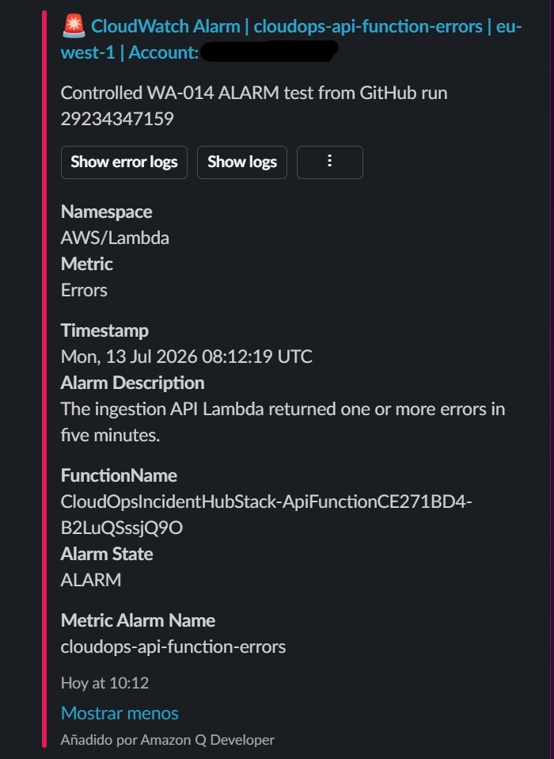
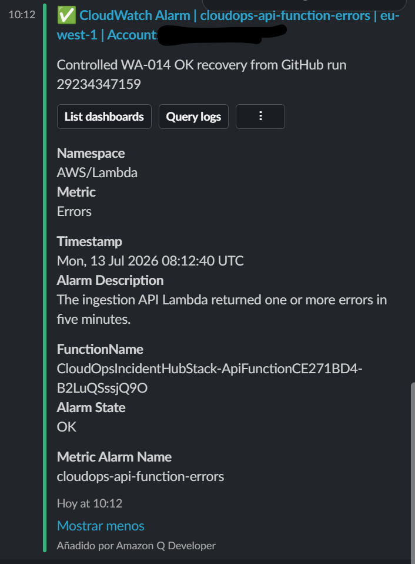

# Evidencia WA-014: entrega de alarmas en Slack

## Estado

**Completado para la arquitectura de referencia y la cuenta AWS de laboratorio.**

La validación se realizó el 13 de julio de 2026 mediante un despliegue efímero
controlado. Esta evidencia no implica que el workload esté preparado para
producción ni sustituye la definición de ownership y guardias operativas.

## Flujo validado

```text
CloudWatch Alarm
        |
        v
       SNS
        |
        v
Amazon Q Developer
        |
        v
Slack #cloudops-alerts
```

## Ejecución

| Campo | Valor |
|---|---|
| Workflow | `Deploy ephemeral AWS lab` |
| GitHub run | `29234347159` |
| Rama | `main` |
| Región | `eu-west-1` |
| Alarma | `cloudops-api-function-errors` |
| Estado inicial | `OK` |
| Estado final | `OK` |
| Limpieza | Stack efímero destruido y ausencia verificada |

## Recursos desplegados

La evidencia automática del workflow registró:

| Recurso | Cantidad |
|---|---:|
| Tópicos SNS | 1 |
| Configuraciones Slack de Amazon Q | 1 |
| Alarmas CloudWatch | 4 |

## Transiciones controladas

| Hora UTC | Transición | Motivo |
|---|---|---|
| 2026-07-13 08:12:19 | `OK -> ALARM` | `Controlled WA-014 ALARM test from GitHub run 29234347159` |
| 2026-07-13 08:12:40 | `ALARM -> OK` | `Controlled WA-014 OK recovery from GitHub run 29234347159` |

CloudWatch confirmó ambas transiciones en el historial de la alarma y el
workflow verificó que el estado final era `OK`.

## Evidencia visual saneada

El identificador de la cuenta AWS se ha ocultado antes de versionar las
capturas.

### Recepción de `ALARM`



### Recepción de recuperación `OK`



## Integridad de las capturas

| Archivo | SHA-256 |
|---|---|
| `wa-014-slack-alarm.png` | `58fbfde38c03aa66004542b89453f9384d35b8ead5f07ae15c4ad976eebf66e8` |
| `wa-014-slack-ok.png` | `3055ecafbe7174aa8f16287621ddb619d13b517589cb0039a8d36e072adcc885` |

## Controles de seguridad y coste

- Los identificadores reales de Slack se proporcionaron mediante secrets del
  environment de GitHub y no se almacenaron en el repositorio.
- GitHub obtuvo credenciales temporales mediante OIDC.
- `cloudwatch:SetAlarmState` quedó limitado a los cuatro ARN de alarmas del
  proyecto.
- La integración ChatOps permanece desactivada por defecto.
- El stack efímero fue destruido incluso durante las ejecuciones fallidas
  previas.
- La ejecución final verificó explícitamente la ausencia del stack después de
  la destrucción.

## Limitaciones

La transición se generó mediante `SetAlarmState` para validar de forma
determinista el canal de notificación. No representa un incidente orgánico de
producción ni sustituye un game day completo. La simulación de fallos,
acumulación de backlog, DLQ y recuperación operacional continúa cubierta por
WA-019.
